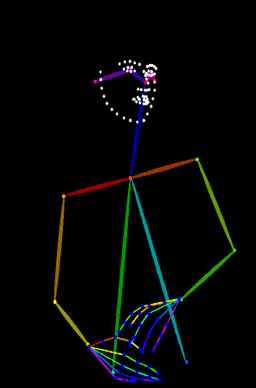
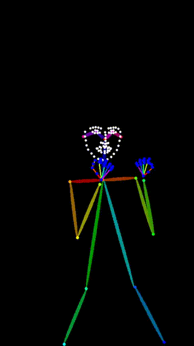

# fast_dwpose

The goal of Easy DWPose is to provide a generic, reliable, and easy-to-use interface for making skeletons for ControlNet.

SF do some improve for [easy-dwpose](https://github.com/reallyigor/easy_dwpose), named it fast-dwpose.

## Installation

### PIP

```bash
pip install easy-dwpose
```

## Quickstart

### In you own .py scrip or in Jupyter

```python
import torch
from PIL import Image
import numpy as np
import json

from easy_dwpose import DWposeDetector

#####---------Setup init
# You can use a different GPU, e.g. "cuda:1"
device = "cuda:0" if torch.cuda.is_available() else "cpu"
detector = DWposeDetector(device=device)
input_image = Image.open("assets/pose.png").convert("RGB")


#####---------Get both the skeleton image
# SF: skeleton should be a kind of img 
skeleton = detector(input_image, output_type="pil", include_hands=True, include_face=True)
# Save the skeleton image
skeleton.save("skeleton.png")


#####---------Get pose data
# SF: pose_data should be numpy/tensor
# # This returns the dictionary
pose_data = detector(input_image, draw_pose=False)

# Save the skeleton pose information:
# Option 1: Save as NPY file
np.save('pose_data.npy', pose_data)

# Option 2: Save as NPZ file
np.savez('pose_data.npz', **pose_data)

# Option 3: Save as JSON file
# Convert numpy arrays to lists for JSON serialization
pose_data_json = {k: v.tolist() if isinstance(v, np.ndarray) else v for k, v in pose_data.items()}
with open('pose_data.json', 'w') as f:
    json.dump(pose_data_json, f)
```

<table align="center">
    <tr>
      <th align="center">Input</th>
      <th align="center">Output</th>
    </tr>
    <tr>
        <td align="center">
          <br />
          
        </td>
        <td align="center">
          <br/>
          
        </td>
    </tr>
</table>

### On a video

```bash
python scripts/inference_on_video.py --input assets/dance.mp4 --output_path result.mp4
```

<table align="center">
    <tr>
      <th align="center">Input</th>
      <th align="center">Output</th>
    </tr>
    <tr>
        <td align="center">
          <br />
          
        </td>
        <td align="center">
          <br/>
          
        </td>
    </tr>
</table>

### On a folder of images

```bash
python scripts/inference_on_folder.py --input assets/ --output_path results/
```

### Easy-DWPose Custom skeleton drawing

By default, we use standart skeleton drawing function but several projects change it (e.g. [MusePose](https://github.com/TMElyralab/MusePose)). Modify it or write your own from scratch!

```python
from PIL import Image
from easy_dwpose import DWposeDetector
from easy_dwpose.draw.musepose import draw_pose as draw_pose_musepose

detector = DWposeDetector(device="cpu")
input_image = Image.open("assets/pose.png").convert("RGB")

skeleton = detector(input_image, output_type="pil", draw_pose=draw_pose_musepose, draw_face=False)
skeleton.save("skeleton.png")
```

### SF Custom skeleton drawing

I prefer ControlNext style, I have developed a visualization method and placed it in `./easy_dwpose/draw/controlnext.py`. It does not integrate with easy dwpose and the calling method is slightly different:

```python
import torch
from PIL import Image
import numpy as np
import json

from easy_dwpose import DWposeDetector
from easy_dwpose.draw.controlnext import draw_pose, process_pose_data 

#####---------Setup init
# You can use a different GPU, e.g. "cuda:1"
device = "cuda:0" if torch.cuda.is_available() else "cpu"
detector = DWposeDetector(device=device)
input_image = Image.open("assets/pose.png").convert("RGB")

#####---------Custom ControlNext drawing style
# Get pose data for custom drawing
pose_data = detector(input_image, draw_pose=False)

# Get image dimensions
width, height = input_image.size

# Process the pose data for custom drawing
processed_pred = process_pose_data(pose_data, height, width)

# Draw pose using custom ControlNext style
vis_img = draw_pose(
    pose=processed_pred,
    H=height,
    W=width,
    include_body=True,
    include_hand=True,
    include_face=True
)

# Convert to PIL Image and save (vis_img is in CHW format)
custom_skeleton = Image.fromarray(vis_img.transpose(1, 2, 0))
custom_skeleton.save("skeleton_controlnext.png")
```

## Acknowledgement

We thank the original authors of the [DWPose](https://github.com/IDEA-Research/DWPose) for their incredible models!

Thanks for open-sourcing!
